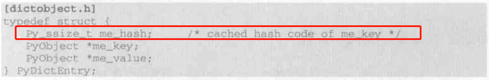

# Python
## Python对象
在Python中任何类型都是对象，包括整数。

### PyObject
包括引用计数`ob_refcnt`和类型结构体`_typeobject`


### 具体对象，如PyIntObject
在Python中，对象的机制核心一个是引用计数，一个是类型信息。


### 变长对象，如PyVarObject
不包含可变数据长度的为“定长对象”，而当存储的为“变长对象”时则需要使用其他对象来存储。


其中`ob_size`是对变长对象数量的统计


`PyTypeObject`里面定义了各种类型的方法，比如说`int`有`add`、`sub`等，还有一些其他信息值。

### Python对象的多态性
通过传递*PyObject来实现


### Python内存管理和引用计数


类似于C++的share_ptr机制，内存管理机制也十分类似，采用内存池进行管理避免大量的申请和释放内存空间。

## PyIntObject对象(在高版本的Python已经统一为使用Long来表示了)


``` C
PyTypeObject PyInt_Type = {
    PyVarObject_HEAD_INIT(&PyType_Type, 0)
    "int",
    sizeof(PyIntObject),
    0,
    (destructor)int_dealloc, // 对象销毁函数
    /* ... 其他类型相关函数指针 ... */
}

```

### 大整数存储


每次扩容都是以PyIntBlock为基础单位


注意block_list和free_list都是**高地址作为头指针**


虚线表示`free_list`，可以看到`del`后`free_list`是向高处移动。


小整数池在一开始便生成，但也是通过`block_list`。


## PyStringObject  

`Python`的字符串对象使用了`intern`机制，并利用`字符缓存池`为小字符对象涉及了对象池`characters`。


`ob_sstate`变量标记了该对象是否经过intern机制的处理。


### 字符串拼接tips

对于多个字符串拼接，利用`list.join()`的效果会高于利用`+`号实现，因为利用前者会一次性分配内存，而对于后者则是每调用一次`+`都要进行内存分配。


## PyListObject


`PyListObject`的扩容和缩容机制与`C++`的`vector`十分类似，但是会创建一个`num_free_lists`的缓冲池，缓冲池由删除对象释放时得到（大小为80给），当调用`del`删除对象时，`PyListObject`的可以保留，但其`ob_item`所对应的内存空间被回收。


## PyDictObject

`PyDictEntry`



在`PyDictEntry`中`me_hash`域存储的是`me_key`的散列值，利用一个域来记录这个散列值可以避免每次查询的时候都要重新计算一遍散列值。


`Dict`的初始内存大小为8

```python
my_dict = dict(capacity=initial_capacity)
```


==**扩容判断**==


==对象缓冲池==

使用了和List一样的机制，只有当PyDictObject对象销毁后对象缓冲池才会存入缓存。


## small Python

理解Python虚拟机利用`PyDictObject`对象来维护变量名到变量值的映射。


## Python虚拟机


